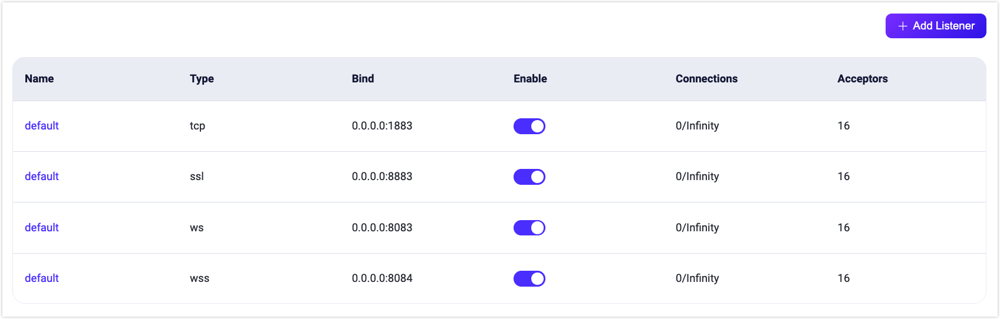
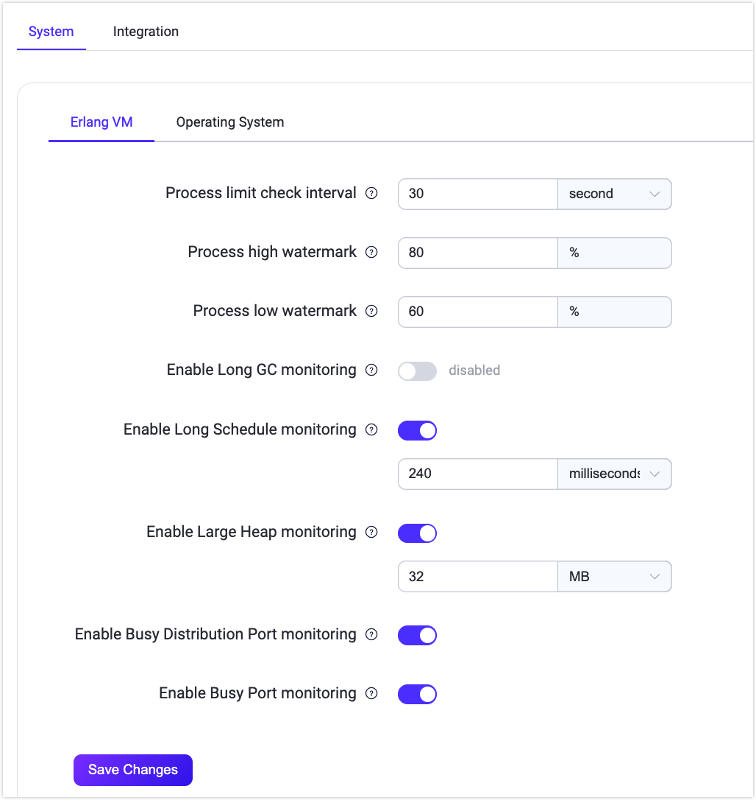

# Management

EMQX provides powerful management features to optimize system configuration, extend protocol support, enhance MQTT advanced features, and enable plugin extensions. These management capabilities allow users to dynamically adjust system settings without stopping the service, improving overall performance and operational flexibility. The main management features include the following aspects:

- **Cluster Settings**: Dynamic configuration adjustments during runtime, supporting core configurations such as MQTT Settings, Listeners, Logging, Monitoring, and Cluster Linking.
- **Advanced MQTT**: Simplified configuration for features such as Topic Rewrite, Auto-Subscription, Delayed Publish, and File Transfer, further expanding MQTT use cases.
- **Extensions**: Built-in extension mechanisms and multi-protocol gateway support provide flexible protocol adaptation, along with support for user-defined hooks and plugin development.

The management features of EMQX are provided through a visual Dashboard interface, offering an intuitive user experience that helps users quickly get started and flexibly use these features to meet the demands of complex IoT scenarios. The following sections provide a detailed description of each module’s features and configurations.

## Cluster Settings

EMQX provides hot configuration capabilities, which can dynamically modify the configuration at runtime without restarting the EMQX node. The EMQX Dashboard provides a visual configuration page for the hot configuration function, allowing you to easily modify the configuration of EMQX. The following configuration items are currently provided:

- MQTT Settings
- Listeners
- Logging
- Monitoring
- Cluster Linking

### MQTT Settings

Click **Management** -> **MQTT Settings** in the left menu to enter the MQTT protocol-related configuration page. In the MQTT Settings page, you can configure various MQTT-related parameters, including:

#### General

The **General** tab page contains general basic configuration items for the MQTT protocol, such as idle timeout, maximum packet size, maximum client ID length, maximum topic levels, and maximum allowed QoS levels.

#### Session

The **Session** tab page includes configuration items related to MQTT session management, such as session expiry interval (only supported for non-MQTT 5.0 connections; MQTT 5.0 connections need to be configured on the client side), maximum subscription count, maximum flight window, and whether to store QoS 0 messages.

#### Durable Sessions

The **Durable Sessions** tab page includes configuration items related to the [MQTT Durable Sessions](../durability/durability_introduction.md) feature, such as message retention duration, message query batch size, idle poll interval, session heartbeat interval, etc.

#### Retainer

The **Retainer** tab page contains MQTT protocol-related configuration items for retained messages, such as whether to enable retained messages, message storage type and method, maximum number of retained messages, retained message payload size, and message expiry interval. For more details, refer to [Configuring Retained Messages](./retained.md#retainer-settings).

> When retained messages are disabled, existing retained messages will not be deleted.

#### System Topic

The **System Topic** tab page provides configuration items for EMQX's built-in system topics. EMQX periodically publishes operational status, usage statistics, and real-time client events to system topics prefixed with `$SYS/`. When clients subscribe to these topics, EMQX will publish related information to those topics. Configuration items for system topics include message publish interval, heartbeat interval, etc.

### Listener

Click on **Management** -> **Listeners** in the left menu to enter the listeners page. This page displays a list of listeners by default. EMQX provides four common listeners:

- TCP listener using port 1883
- SSL/TLS secure connection listener using port 8883
- WebSocket listener using port 8083
- WebSocket secure listener using port 8084

Typically, you can use these default listeners by specifying the corresponding port and protocol type. To add another type of listener, click the **+Add Listener** button in the top-right corner to create a new listener.

#### Add Listener

In the **Add Lisenter** pop-up panel, you will see a form for adding a listener, which contains the basic configuration items. You can enter a name for the listener to identify it, choose the listener type (TCP, SSL, WS, WSS), and enter the listener address (IP address and port number). Using the IP address can restrict the listener's access range, or you can directly specify a port number.

##### Rate Limiting

In the **Limiter** section of the **Add Listener** form, you can limit the message receiving and publishing rates during EMQX operation, such as:

- Maximum Connection Rate (Listener)
- Maximum Message Publishing Rate (Per Client)
- Maximum Message Publishing Rraffic (Per Client)

Configuring rate limiting ensures the stability of the system and network when message data overload or excessive client requests occur.

For more detailed configuration on rate limiting, refer to [Rate Limit](../rate-limit/rate-limit.md).

For more details on listener configuration, refer to [EMQX Open Source Configuration Manual](https://docs.emqx.com/en/emqx/v@CE_VERSION@/hocon/) and  [EMQX Enterprise Configuration Manual](https://docs.emqx.com/en/enterprise/v@EE_VERSION@/hocon/).

#### Manage Listeners

After adding a listener, you can see it in the list. Click on the listener's name to enter the editing page, where you can modify or delete the listener configuration. Note that the listener name, type, and listener address cannot be modified in the settings.

Click the **Delete** button in the editing page to remove the listener. When deleting a listener, you will need to enter the listener's name to confirm the deletion. You can also toggle the enable switch to enable or disable the listener. The list also shows the number of connections for each listener.

::: tip Warning

Modifying and deleting listeners is a risky operation and should be done carefully. If a listener is updated or deleted, client connections on that listener will be disconnected.

:::

### Logging

Click **Management** -> **Logging** in the left menu to enter the log configuration page. This page includes tabs for **Console Log**, **File Log**, **Log Throttling**, and **Audit Log**.

EMQX supports two types of log output: console log and file log. You can choose either or both types according to your needs. In the corresponding configuration page, you can enable or disable the log handler, set the log level, log format type, and for file logs, specify the log file path and log name. For more detailed configuration instructions on logs, refer to [Configure Logging via Dashboard](../observability/log.md#configure-logging-via-dashboard).

In the **Log Throttling** tab page, you can configure the time window for log throttling. For more information on log throttling, refer to [Log Rate Limiting](../observability/log.md#log-throttling).

In the **Audit Log** page, you can enable or disable the audit log feature in the EMQX Enterprise edition and configure it. For detailed configuration instructions, refer to [Audit Log](./audit-log.md).

### Monitoring

::: tip Note

The Monitoring feature is only available in the EMQX Enterprise edition.

:::

Click on **Management** -> **Monitoring** in the left menu to enter the monitoring integration configuration page. This page contains two tabs:

- **System**: Depending on the user's needs, the settings for the [Alarms](./diagnose.md#alarms) function, such as alarm thresholds, check intervals, etc., can be adjusted to a certain extent according to user needs.
- **Integration**: Provides configuration for integration with third party monitoring platforms.

#### System

If the default value of the current alarm trigger threshold or alarm monitoring check interval does not meet the actual needs of you, you can adjust the settings on this page. The current settings are divided into two modules: **Erlang VM** and **Operating System**, the default values and descriptions of each configuration item can be found in [Alarms](../observability/alarms.md).

#### Integration

This page mainly provides integration configurations with third-party monitoring platforms. Currently, EMQX supports integration with **Prometheus**, **OpenTelemetry**, and **Datadog**.

When using the `Prometheus` third-party monitoring service, you can quickly enable the configuration on this page and set parameters such as the push data address and data reporting interval. You can directly use the API `/prometheus/stats` provided by EMQX to get monitoring data. When using this API, no authentication information is required. Please refer to [Prometheus](../observability/prometheus.md) for specific API.

In most cases, you do not need to use `Pushgateway` to monitor the metrics data of EMQX. And you can choose to configure a `Pushgateway` service address to push the monitoring data to `Pushgateway`, and then `Pushgateway` pushes the data to the `Prometheus` service. Click to view [When to use Pushgateway](https://prometheus.io/docs/practices/pushing/).

On the bottom of the page, click the **Help** button, select the default or use the `Pushgateway` method, configure the address or API information of the relevant service according to the provided usage steps, and then quickly generate the corresponding `Prometheus` configuration file. Finally, use this configuration file to start the `Prometheus` service.

Users can customize and modify the monitoring data in `Grafana` according to their needs. After starting the `Prometheus` service, you can click the `Download Grafana Template` button at the end of the help page to download the configuration file of the default dashboard provided by us. Import the file into `Grafana`, and we can view the monitoring data of EMQX through the visualization panel. Users can also download the template from the [Grafana official website](https://grafana.com/grafana/dashboards/17446-emqx/).

For detailed configuration of OpenTelemetry and Datadog integration, refer to [Integrate with OpenTelemetry](../observability/open-telemetry/open-telemetry.md) and [Integrate with Datadog](../observability/datadog.md).

### Cluster Linking

::: tip Note

The Cluster Linking feature is only available in the EMQX Enterprise edition.

:::

The Cluster Linking feature allows multiple independent EMQX clusters to be connected, enabling clients in geographically dispersed clusters to communicate with each other. Users can create and configure cluster links on this page. For detailed guidance on creation and configuration, refer to [EMQX Cluster Linking](../cluster-linking/introduction.md).

## Advanced MQTT Features

::: tip Note

Advanced MQTT features are only available in the EMQX Enterprise edition.

:::

### Topic Rewrite

The Topic Rewrite feature allows modification of device business topics. By setting up rules in EMQX, it can rewrite the original topic to a new target topic during subscription or publishing. This page enables users to add topic rewriting rules via the Dashboard without modifying configuration files. For detailed topic rewriting rules, refer to [Topic Rewrite](../messaging/mqtt-topic-rewrite.md).

### Auto-Subscription

Auto-subscription is an MQTT extension feature supported by EMQX. It allows EMQX to automatically subscribe to specified topics for devices based on predefined rules after they successfully connect, without requiring additional subscription requests. This page allows users to configure the auto-subscription feature via the Dashboard. For detailed configuration guidance, refer to [Auto-Subscription](../messaging/mqtt-auto-subscription.md).

### Delayed Publish

Delayed publish is an MQTT extension feature supported by EMQX. When a client publishes a message using a special topic prefix `$delayed/{DelayInterval}`, the delayed publish feature is triggered, allowing the message to be published after a user-configured delay interval. This page enables users to configure the delayed publish feature via the Dashboard. For detailed configuration guidance, refer to [Configure Delayed Publish via Dashboard](../messaging/mqtt-delayed-publish.md#configure-delayed-publish-via-dashboard).

### File Transfer

File transfer based on MQTT is an advanced feature of EMQX Enterprise edition. EMQX extends the MQTT protocol to allow client devices to transfer, manage, and store offline file data, such as audio, video, images, and diagnostic logs, in addition to transmitting real-time structured data like sensor data and control instructions. You can configure this feature on the file transfer page. For detailed configuration guidance, refer to [Enabling and Configuring File Transfer via Dashboard](../file-transfer/broker.md#enable-and-configure-file-transfer-via-dashboard).

## Extensions

::: tip Note

MQTT extension features are only available in the EMQX Enterprise Edition.

:::

The plugins menu provides built-in extension-related configuration options in EMQX, offering additional features for MQTT protocol clients, including multi-protocol gateways, ExHook, and plugins.

### Gateways

EMQX Multi-Protocol Gateways support handling all non-MQTT protocol connections, authentication, and message sending and receiving. They provide a unified conceptual model for various protocols.

In the gateways page, you can enable a gateway and configure its basic settings, such as listener configuration. EMQX also provides custom configuration options. For detailed configuration guidance, refer to the quick start documentation for the following common gateways:

- [MQTT-SN](../gateway/mqttsn.md)
- [STOMP](../gateway/stomp.md)
- [CoAP](../gateway/coap.md)
- [LwM2M](../gateway/lwm2m.md)
- [ExProto](../gateway/exproto.md)

The following gateways are only supported in the EMQX Enterprise Edition:

- [OCPP](../gateway/ocpp.md)
- [GB/T 32960](../gateway/gbt32960.md)
- [JT/T 808](../gateway/jt808.md)

### ExHook

Hooks are a common extension mechanism that allows developers to execute custom code at specific event points. EMQX supports the hook mechanism, enabling users to flexibly modify or extend system functionalities by intercepting module function calls, message passing, and event delivery.

In the ExHook page, you can view basic information and the status of hooks, as well as add and configure them.

### Plugins

EMQX supports extending custom business logic through plugins or implementing other protocol adaptations via the plugin protocol extension interface. On the plugins page, you can install and start developed plugin packages and maintain or configure them. For detailed usage guidance, refer to [Plugins](../extensions/plugins.md).
