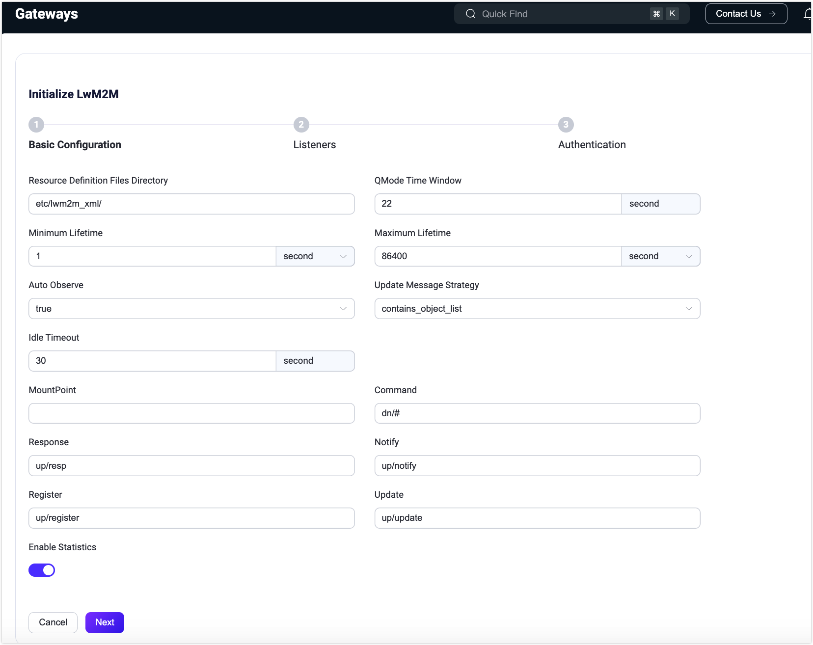

# Extensions

With the Extensions features, users can use the gateway to access non-MQTT protocol connections and message publishing and receiving, and use the Plugin or ExHook to modify and extend the system. Click **Management** and scroll down to the **Extension** section, where you will find:

- **Gateways**: Handles connections, authentication, and message sending and receiving for all non-MQTT protocols and provides a unified user layer interface and concept for them.
- **ExHook**: Provides the ability to modify or extend the system functionality of EMQX using other languages.
- **Plugins**: Modifies or extends system functionality by installing plugins written in Erlang.

## Gateways

EMQX Multi-Protocol Gateways support handling all non-MQTT protocol connections, authentication, and message sending and receiving. They provide a unified conceptual model for various protocols.

In the gateways page, you can enable a gateway and configure its basic settings, such as listener configuration. EMQX also provides custom configuration options. For detailed configuration guidance, refer to the quick start documentation for the following common gateways:

- [MQTT-SN](../gateway/mqttsn.md)
- [STOMP](../gateway/stomp.md)
- [CoAP](../gateway/coap.md)
- [LwM2M](../gateway/lwm2m.md)
- [ExProto](../gateway/exproto.md)

The following gateways are only supported in the EMQX Enterprise Edition:

- [OCPP](../gateway/ocpp.md)
- [GB/T 32960](../gateway/gbt32960.md)
- [JT/T 808](../gateway/jt808.md)

Before enabling a gateway, it must be properly set up. Once set up, you can monitor the number of connections for each enabled protocol gateway and manage gateway statuses (enable/disable) on the **Gateways** page.

::: tip
Disabling a gateway will cause all connections under the gateway to be disconnected, and the connections need to be re-established. Please be careful.
:::

### Gateway Setup

On the Gateways page, select the protocol gateway you wish to enable and click the **Setup** button in the **Action** column. The page for initializing the protocol gateway includes three steps:

1. Configure the basic configurations
2. Configure listeners
3. Configure the authentication

Configuration items can be different for different protocol gateways. You can update the configuration items after the initialization is completed by going to the [Gateway Details](#gateway-details) page.

> Gateways configured via Dashboard will take effect across the cluster.

#### Basic Configuration

Configuration items can be different for different protocol gateways. For detailed configuration guidance, refer to the documentation for specific gateways.

#### Listeners

After completing the basic configuration, you can proceed to set up the gateway's listeners. Each gateway can have multiple listeners enabled, depending on the protocol. The following table outlines the supported listener types for various protocol gateways:

|            | TCP  | UDP  | SSL  | DTLS |
| ---------- | ---- | ---- | ---- | ---- |
| STOMP      | ✔︎    |      | ✔︎    |      |
| CoAP       |      | ✔︎    |      | ✔︎    |
| ExProto    | ✔︎    | ✔︎    | ✔︎    | ✔︎    |
| MQTT-SN    |      | ✔︎    |      | ✔︎    |
| LwM2M      |      | ✔︎    |      | ✔︎    |
| ExProto    |      |      |      |      |
| OCPP       |      |      |      |      |
| GB/T 32960 |      |      |      |      |

#### Authentication

After configuring the listener, you can optionally configure the protocol gateway's access authentication as needed, or allow any client to connect in if no authenticator is configured; different protocol gateways support the following authentication types

|            | HTTP Server | Built-in Database | MySQL | MongoDB | PostgreSQL | Redis | DTLS | JWT  | Scram | LDAP |
| ---------- | ----------- | ----------------- | ----- | ------- | ---------- | ----- | ---- | ---- | ----- | ---- |
| STOMP      | ✔︎           | ✔︎                 | ✔︎     | ✔︎       | ✔︎          | ✔︎     | ✔︎    | ✔︎    |       |      |
| CoAP       | ✔︎           | ✔︎                 | ✔︎     | ✔︎       | ✔︎          | ✔︎     | ✔︎    | ✔︎    |       |      |
| ExProto    | ✔︎           | ✔︎                 | ✔︎     | ✔︎       | ✔︎          | ✔︎     | ✔︎    | ✔︎    |       |      |
| MQTT-SN    | ✔︎           |                   |       |         |            |       |      |      |       |      |
| LwM2M      | ✔︎           |                   |       |         |            |       |      |      |       |      |
| ExProto    | ✔︎           | ✔︎                 | ✔︎     | ✔︎       | ✔︎          | ✔︎     |      | ✔︎    |       | ✔︎    |
| OCPP       | ✔︎           | ✔︎                 | ✔︎     | ✔︎       | ✔︎          | ✔︎     |      | ✔︎    |       | ✔︎    |
| GB/T 32960 | ✔︎           |                   |       |         |            |       |      |      |       |      |

### Gateway Details

Once the protocol gateway is enabled, you will be redirected to the **Gateways** page. Here, you can manage and customize the gateway settings:

- **Customize Settings**: Click the **Settings** button in the **Actions** column to update the gateway's basic configuration, listener settings, and authentication settings as needed.
- **View Connected Clients**: Click the **Clients** button in the **Actions** column to view a list of clients connected to the server via the protocol gateway. The client list includes details such as the client ID, username, IP address (same as displayed on the Clients page), status, and the time of connection or registration. To disconnect a client, click the **Kick Out** button in the **Actions** column.
- **Search Clients**: Use filters for client ID, username, and node to quickly locate specific clients.

## ExHook

Hooks are a common extension mechanism that allows developers to execute custom code at specific event points. ExHook provides the ability to modify or expand system functions using other programming languages. The hook mechanism supported in EMQX enables users to flexibly modify or extend system functionalities by intercepting module function calls, message passing, and event delivery.

In the ExHook page, you can view basic information and the status of currently added hooks, as well as add and configure them.

Definitions and development guidelines for ExHooks can be found in [hooks](../extensions/hooks.md).

### Add ExHook

Click the **+ Add** button at the top right of the page to go to the Add ExHook page. Configure the settings with the basic information and connection parameters of the ExHook to be added and click **Create** to submit the data. After successful creation, you will be redirected to the ExHook list page.

### View Details

After successful creation, you can access the ExHook details page by clicking on the ExHook name on the ExHook list page. On the details page, you can view the current ExHook metrics, including the total number of registered hooks, the total number of successful executions, the total number of failed executions and the current execution rate of all hooks. You can edit the basic information and click the **Update** button to save it.

Click on **Registered hooks** tab to view the list of hooks currently implemented by ExHook, as well as the parameters and execution metrics of each hook.

## Plugins

EMQX supports extending custom business logic through plugins or implementing other protocol adaptations via the plugin protocol extension interface. On the Plugins page, you can install and start developed plugin packages and maintain or configure them. For detailed usage guidance, refer to [Plugins](../extensions/plugins.md).

To manage system plugins, navigate to **Plugins** under the **Extensions** menu on the left.

### Plugin List

The **Plugins** page displays a list of installed plugins, showing details such as the plugin name, version, author, and running status. To locate specific plugins, use the filters at the top of the page to search by name or running status.

### Install a Plugin

1. Click the **+ Install Plugin** button in the upper-right corner to open the plugin installation page.
2. Upload the plugin package or drag and drop it into the dotted box.
3. Click the **Install** button to complete the installation.

Once the package is successfully installed, you will be redirected to the plugin list page. Newly installed plugins are stopped by default. To activate a plugin, click the **Start** button next to it.

### Manage Plugin Execution Order

For systems with multiple plugins, the order of execution is determined by the enablement sequence. You can adjust this order by:

- Dragging and dropping plugins directly on the page.
- Using the sorting option under the **More** menu in the **Actions** column.

The updated execution order takes effect after the next node restart.

### Uninstall a Plugin

To remove a plugin, click the **Uninstall** button under the **More** menu in the **Actions** column.

### Plugin Details

Click on a plugin's name to access its details page. This page provides:

- **Documentation**: The left panel displays the `README.md` file from the plugin installation package.
- **Plugin Information**: The right panel shows metadata from the `release.json` file, such as version, author, and other relevant details.

If the plugin's documentation includes a developer website link, you can visit it by clicking **Read More** in the top-right corner.

