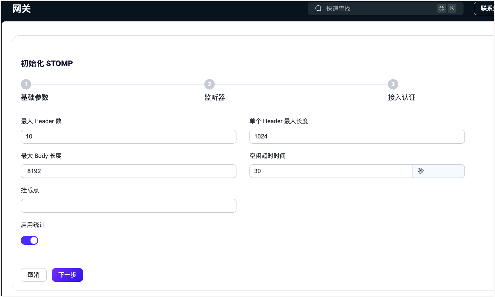

# 插件扩展

通过插件扩展功能，用户可使用网关接入非 MQTT 协议的连接和消息收发，使用插件或 ExHook 来修改和扩展系统功能。展开左侧菜单中的**管理**菜单，导航到**插件扩展**分类，下面包括：

- **网关**：负责处理所有非 MQTT 协议的连接、认证和消息收发，并为其提供统一的用户层接口和概念。
- **ExHook**：提供了使用其他语言对 EMQX 进行系统功能的修改或扩展的能力。
- **插件**：通过安装使用 Erlang 编写的插件，修改或扩展系统功能。

## 网关

EMQX 多协议网关支持处理所有非 MQTT 协议的连接、认证以及消息的收发操作，并为各种协议提供了统一的概念模型。

在**网关**页面中，您可以启用网关并配置其基本设置，例如监听器配置。EMQX 还提供了自定义配置选项。有关详细的配置指导，请参考以下常见网关的快速入门文档：

- [MQTT-SN](../gateway/mqttsn.md)
- [STOMP](../gateway/stomp.md)
- [CoAP](../gateway/coap.md)
- [LwM2M](../gateway/lwm2m.md)
- [ExProto](../gateway/exproto.md)

以下网关仅在 EMQX 企业版中支持：

- [OCPP](../gateway/ocpp.md)
- [GB/T 32960](../gateway/gbt32960.md)
- [JT/T 808](../gateway/jt808.md)

在启用网关之前，必须先完成其正确的配置。一旦配置完成，您可以在**网关**页面中监控每个已启用协议网关的连接数量，并管理网关状态（启用/禁用）。

::: tip
停用一个网关，会导致该网关下的所有连接断开，需要重新建立连接。请谨慎操作。
:::

### 网关初始化

在网关页面，选择想要启用的协议网关，点击列表右侧的**配置**按钮，进入初始化协议网关页面。初始化网关分三个步骤：

1. 配置基础参数。
2. 配置监听器。
3. 配置接入认证。

各个配置项都会因为协议网关的不同而不一样；配置项可在初始化完成后，进入网关详情页面进行更改。

> 通过 Dashboard 配置的网关会在整个集群中生效。

#### 基础参数

基础参数配置表单会因为协议网关的不同而不同，各协议配置参数的详情可点击跳转至配置文件说明页面查看。

#### 监听器

配置基础参数完成，可配置网关的监听器。每个网关都可以启用多个监听器，不同协议网关对监听器的类型支持如下

|            | TCP  | UDP  | SSL  | DTLS | Websocket | Websocket over TLS |
| ---------- | ---- | ---- | ---- | ---- | --------- | ------------------ |
| STOMP      | ✔︎    |      | ✔︎    |      |           |                    |
| CoAP       |      | ✔︎    |      | ✔︎    |           |                    |
| ExProto    | ✔︎    | ✔︎    | ✔︎    | ✔︎    |           |                    |
| MQTT-SN    |      | ✔︎    |      | ✔︎    |           |                    |
| LwM2M      |      | ✔︎    |      | ✔︎    |           |                    |
| OCPP       |      |      |      |      | ✔︎         | ✔︎                  |
| JT/T 808   | ✔︎    |      | ✔︎    |      |           |                    |
| GB/T 32960 | ✔︎    |      | ✔︎    |      |           |                    |

#### 接入认证

配置完监听器，可根据需要，选择性的配置协议网关的接入认证，如果不配置认证器则认为允许任何客户端登录；不同协议网关对认证类型的支持如下：

|            | HTTP Server | Built-in Database | MySQL | MongoDB | PostgreSQL | Redis | DTLS | JWT  | Scram | LDAP |
| ---------- | ----------- | ----------------- | ----- | ------- | ---------- | ----- | ---- | ---- | ----- | ---- |
| STOMP      | ✔︎           | ✔︎                 | ✔︎     | ✔︎       | ✔︎          | ✔︎     | ✔︎    | ✔︎    |       |      |
| CoAP       | ✔︎           | ✔︎                 | ✔︎     | ✔︎       | ✔︎          | ✔︎     | ✔︎    | ✔︎    |       |      |
| ExProto    | ✔︎           | ✔︎                 | ✔︎     | ✔︎       | ✔︎          | ✔︎     | ✔︎    | ✔︎    |       |      |
| MQTT-SN    | ✔︎           |                   |       |         |            |       |      |      |       |      |
| LwM2M      | ✔︎           |                   |       |         |            |       |      |      |       |      |
| ExProto    | ✔︎           | ✔︎                 | ✔︎     | ✔︎       | ✔︎          | ✔︎     |      | ✔︎    |       | ✔︎    |
| OCPP       | ✔︎           | ✔︎                 | ✔︎     | ✔︎       | ✔︎          | ✔︎     |      | ✔︎    |       | ✔︎    |
| GB/T 32960 | ✔︎           |                   |       |         |            |       |      |      |       |      |

### 网关详情

启用协议网关后，您将被重定向到**网关**页面。在这里，您可以管理和自定义网关设置：

- **自定义设置**：点击**操作**列中的**设置**按钮，根据需要更新网关的基本配置、监听器设置和认证设置。
- **查看已连接客户端**：点击**操作**列中的**客户端**按钮，查看通过协议网关连接到服务器的客户端列表。该列表包括客户端 ID、用户名、IP 地址（与客户端页面显示的相同）、状态以及连接或注册的时间。如需断开客户端连接，可点击**操作**列中的**踢除**按钮。
- **搜索客户端**：通过客户端 ID、用户名和节点的筛选功能快速定位特定客户端。

## ExHook

钩子（Hook）是一种常见的扩展机制，允许开发者在特定事件点执行自定义代码。ExHook 提供了使用其他编程语言修改或扩展系统功能的能力。EMQX 支持的钩子机制使用户能够通过拦截模块函数调用、消息传递和事件分发，灵活地修改或扩展系统功能。

在 **ExHook** 页面，您可以查看当前已添加钩子的基本信息和状态，并进行添加和配置操作。

关于 ExHook 的定义和开发指南，请参考 [钩子](../extensions/hooks.md)。

### 添加 ExHook

点击页面右上方的**添加**按钮，进入添加 ExHook 页面。在表单中填写需要添加的 ExHook 的基本信息及连接参数，点击**创建**按钮提交数据。创建成功后将跳转回 ExHook 列表页。

### 查看详情

创建成功后，可在 ExHook 列表页面，点击 ExHook 名称进入 ExHook 详情页。在详情页中，可查看当前 ExHook 的指标数据，包括当前 ExHook 的已注册钩子总数，所有钩子的执行成功总数、失败总数、当前执行速率。下方为 ExHook 的基本信息，可以对基本信息进行编辑然后点击**更新**按钮进行保存。

页面上方点击**已注册钩子**页签可查看当前 ExHook 实现的钩子列表，及各个钩子参数和执行指标数据。

## 插件

EMQX 支持通过插件扩展自定义业务逻辑或通过插件协议扩展接口实现其他协议的适配。在**插件**页面，您可以安装和启动已开发的插件包，并对其进行维护和配置。有关详细的使用指南，请参考[插件](../extensions/plugins.md)。

### 插件列表

**插件**页面显示已安装插件的列表，包括插件名称、版本、作者以及运行状态等详细信息。您可以通过页面顶部的筛选功能，根据名称或运行状态快速查找特定插件。

### 安装插件

1. 点击页面右上角的 **+ 安装插件** 按钮，进入插件安装页面。
2. 上传插件包，或将插件包拖放到页面中的虚线框中。
3. 点击**安装**按钮完成安装。

插件包安装成功后，系统会重定向到插件列表页面。新安装的插件默认处于停止状态。要启用插件，请点击相应插件右侧的启动**按钮。

### 管理插件执行顺序

当系统中安装了多个插件时，其执行顺序由启用顺序决定。您可以通过以下方式调整顺序：

- 在页面中直接拖放插件进行排序。
- 使用 **操作**列下**更多**菜单中的排序选项。

调整后的执行顺序将在下次节点重启后生效。

### 卸载插件

如果不再需要某个插件，可以点击**操作**列下**更多**菜单中的**卸载**按钮将其移除。

点击插件名称将跳转至插件详情页，详情页左侧展示插件安装包中 `README.md` 的文档内容，右侧展示插件安装包中 `release.json` 文件中提供的插件的相关信息，如果文件中还提供了插件开发者的相关网站，可以点击页面右上角的**了解更多**跳转至相关页面。

